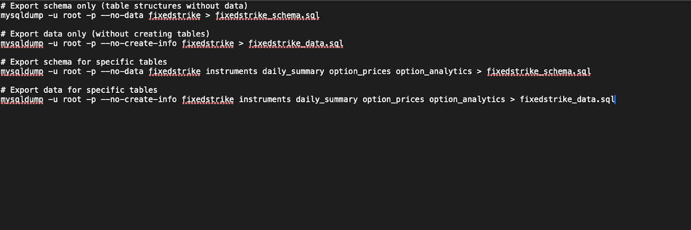
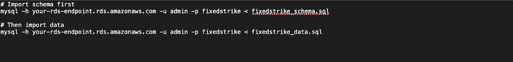

# Midterm Blog

In this blog, I'm going to walk you through how to deploy a SPA app with a frontend, backend, and MySQL to the cloud manually. The database will be MySQL in a private RDS. We will get a domain name from Name.com and migrate it to Route53 with SSL enabled using LetsEncrypt. Then, we will set up an infrastructure repository in GitHub to establish a nightly deployment workflow that will test the SPA in a temporary EC2, perform a smoke test, and upon success, create a container image and push it to an ECR. The image will then be deployed to a pre-allocated EC2 from the ECR. Let's get started!

## Clone the Repository

```
git clone https://github.com/p-archamb/FixedStrikeVolatility
```

## Test the Application Locally

Run the following command in the terminal:

```
docker compose up
```

This command will use the Docker files and should display the app as shown below. To see the application, open a browser and visit:

```
localhost:8081
```

Great! Now that the application is working, let’s get it running in the cloud!

---

# Step 1: Set Up an RDS MySQL Instance

1. **Log in to AWS Console**
   - Go to your AWS Academy account and launch the AWS Console.
2. **Navigate to RDS**
   - Search for "RDS" in the AWS Console and select it.
3. **Create a Database**
   - Click "Create database."
   - Choose "Standard create."
   - Under Engine options, select "MySQL."
   - Choose MySQL 8.0 as the version.
4. **Configure Settings**
   - Select "Free tier."
   - Set DB instance identifier: `fixedstrike.`
   - Set Master username: `admin.`
   - Create and confirm a password.
5. **Instance Configuration**
   - Select "Burstable classes" then `db.t3.micro` (or smallest available).
   - Storage: 20 GB General Purpose SSD (minimum).
6. **Connectivity**
   - Use default VPC.
   - Set "Public access" to **Yes** (for initial configuration).
   - Create a new VPC security group: `fixedstrike-db-sg.`
7. **Additional Configuration**
   - Initial database name: `fixedstrike.`
8. **Create Database**
   - Click "Create database."
   - Wait 5-10 minutes for database creation.

---

# Step 2: Load Schema/Data into Database

1. **Export your local MySQL database schema and data**
   - Use `mysqldump` to export the database into SQL files.


2. **Import to your AWS RDS MySQL instance**
   - Use `fixedstrike_schema.sql` and `fixedstrike_data.sql` from the repository.
   - Replace `your-rds-endpoint.rds.amazonaws.com` with your actual RDS endpoint.

3. **Handling Authentication Plugin Issues**
   - If you encounter authentication errors, use **DBeaver** to connect to the RDS instance instead of the command line.
   - Click "New Database Connection" (the database + icon)
    - Select "Connect by Host" (not URL)
   - Select MySQL
   - Enter your RDS details:
     - Server Host: Your RDS endpoint (e.g., your-db.abc123xyz.region.rds.amazonaws.com)
     - Port: 3306
     - Database: fixedstrike
     - Username: admin
     - Password: Your RDS password
    - Import Schema and data:
      - Right-click on your RDS connection
      - Select "Tools" → "Execute Script"
      - Navigate to your exported schema file (fixedstrike_schema.sql)
      - Execute the script
      - Repeat for your data file (fixedstrike_data.sql)

---

# Step 3: Create an EC2 Instance for Your Application

1. **Navigate to EC2**
   - Go to the EC2 service in the AWS Console.
2. **Launch an Instance**
   - Click "Launch instances."
   - Name: `fixedstrike-qa-instance.`
3. **Select AMI**
   - Choose "Amazon Linux 2023" AMI.
4. **Instance Type**
   - Select `t2.micro` (free tier eligible).
5. **Key Pair**
   - Create a new key pair (`fsv-key.pem`).
6. **Network Settings**
   - Create a new security group (`fsv-app-sg`).
   - Add inbound rules for **SSH (22), HTTP (80), and HTTPS (443).**
7. **Configure Storage**
   - Default 8 GB is sufficient.
8. **User Data (Bootstrap Script)**
   - Install Docker, Docker Compose, AWS CLI, and Certbot for SSL.


---

# Step 4: Make RDS Private and Set EC2 Connection

1. **Modify RDS to Private**
   - Go to RDS > Select `fixedstrike-db` > Click "Modify."
   - Set "Not publicly accessible."
2. **Update Security Groups**
   - Allow MySQL/Aurora (3306) access from the EC2 security group.
     - Select the fixedstrike-db-sg security group you created
     - Click "Edit inbound rules"
     - Add a rule: 
       - Type: MySQL/Aurora (3306)
       - Source: Custom, then add the CIDR for your EC2 security group

---

# Step 5: Create ECR Repository for Docker Images

1. **Navigate to ECR** in AWS Console.
2. **Create a repository:**
   - Name it `fsv-app.`
   - Note the **Repository URI** for later use.

---

# Step 6: Build and Push Docker Image

1. **Configure AWS CLI**
   ```
   aws configure
   aws configure set aws_session_token 'session_token'
   ```
2. **Authenticate to ECR**
   ```
   aws ecr get-login-password --region us-east-1 | docker login --username AWS --password-stdin YOUR_AWS_ACCOUNT_ID.dkr.ecr.us-east-1.amazonaws.com
   ```
    - This command generates a temporary authentication token and the pipe(|) sends that token to docker login as the password input
    - ECR requires authentication before you can push or pull images. This securely authenticates your Docker client with AWS ECR
    - The authentication details are saved in Docker locally for 12 hours. Which allows the subsequent commands like docker push to your ECR
3. **Build and Push Image**
   ```
   $docker buildx create –use
   $docker buildx inspect –bootstrap
   $docker buildx build --platform linux/amd64,linux/arm64 -t YOUR_AWS_ACCOUNT_ID.dkr.ecr.us-east-1.amazonaws.com/fsv-app:latest . --push
   $docker push YOUR_AWS_ACCOUNT_ID.dkr.ecr.us-east-1.amazonaws.com/fsv-app:latest
   ```
4. **Deploy to EC2**
   ```
   ssh -i your-key.pem ec2-user@YOUR_EC2_PUBLIC_IP
   docker-compose up -d
   ```
   - Replace your-key.pem with the path to your key file
   - Replace YOUR_EC2_PUBLIC_IP with your EC2 instance's public IP address
5. **Create docker-compose file on EC2**
   ```
   $mkdir -p ~/app
   $cd ~/app
   $nano docker-compose.yml
   ```
   
5. **Create deployment script on EC2**
   ```
   $cd /opt/deployment
   $nano deploy.sh
   ```
   
   Make the script executable:
   ```
   $chmod +x /opt/deployment/deploy.sh
   ```

   Authenticate to ECR from EC2
   ```
   $aws configure
   $aws ecr get-login-password --region us-east-1 | docker login --username AWS --password-stdin YOUR_AWS_ACCOUNT_ID.dkr.ecr.us-east-1.amazonaws.com
   ```

   Run Your Application
   ```
   $docker-compose up -d
   $docker ps
   ```

   Test Application
     - Open a web browser and go to: http://YOUR_EC2_PUBLIC _IP: 8080
     - Make requests to the database, everything should be fully functional 


---

# Domain Name Setup and SSL Configuration

### Part 1: Domain Name Setup

1. Purchase a domain on **Name.com.**
2. Migrate the domain to **Route53.**
   - Navigate to Route53 service
   - Create a hosted zone:
   - Enter your domain name (e.g., example.com) and select "Public hosted zone", then click "Create"
   - After creation, note the four NS (Name Server) records that AWS provides
   - Return to Name.com:
    - Go to domain management
    - Find DNS or Nameserver settings
    - Replace the existing nameservers with the four AWS nameservers
    - Save changes

3. Verify DNS propogation
   ```
   $dig NS yourdomain.com
   ```

### Part 2: SSL Configuration with Let's Encrypt

1. **Update DNS A Records in Route53** to point to EC2’s public IP.
   - Go to Route53 service
   - Select your hosted zone
   - Create an A record for the root domain:
     - Name: Leave blank (or @)
     - Type: A - IPv4 address
     - Value: Your EC2 public IP address
     - TTL: 300
2. **Install and Configure Nginx.**

   ```
   # Create a configuration file for your domain 
   $sudo nano /etc/nginx/conf.d/yourdomain.com.conf
   ```

3. **Test Nginx Configuration.**
   ```
   $sudo nginx -t
   $sudo systemctl reload nginx
   ```
4. **Obtain SSL Certificate using Certbot.**
   ```
   sudo certbot --nginx -d yourdomain.com -d www.yourdomain.com
   ```
5. **Verify Certificate Installation.**
   ```
   sudo cat /etc/nginx/conf.d/yourdomain.com.conf
   ```

6. **Set up Auto-renewal.**
   ```
   sudo certbot renew --dry-run
   sudo crontab -e
   0 0,12 * * * certbot renew --quiet
   ```

---

# Nightly QA Deployment Workflow

Now you can access the application via the domain name, and it’s encrypted! Next, let’s implement a nightly QA deployment workflow using a new infrastructure GitHub repository.

## Step 1: Create Infrastructure Repository

1. Create a new repository for your infrastructure. You can use the following:
   - Git clone: [https://github.com/p-archamb/fixedstrikeInfrastructure.git](https://github.com/p-archamb/fixedstrikeInfrastructure.git)

2. Complete authentication setup by creating a GitHub Personal Access Token (PAT).

### Creating a Personal Access Token (PAT)

1. **Generate a PAT on GitHub:**
   - Go to **GitHub Account Settings**.
   - Click on **"Developer settings"** in the left sidebar.
   - Select **"Personal access tokens" → "Tokens (classic)"**.
   - Click **"Generate new token" → "Generate new token (classic)"**.
   - Name it descriptively (e.g., `"Infrastructure CI/CD"`).
   - Set an expiration date (consider security implications).
   - Select the following scopes:
     - `repo` (all repository permissions).
     - `workflow` (if you need to trigger workflows).
   - Click **"Generate token"**.
   - **Important:** Copy the generated token immediately—GitHub only shows it once!

2. **Store the PAT as a GitHub Secret:**
   - Go to your **infrastructure repository** on GitHub.
   - Click **"Settings" → "Secrets and variables" → "Actions"**.
   - Click **"New repository secret"**.
   - Name: `SOURCE_REPO_PAT`
   - Value: Paste the **Personal Access Token (PAT)**.
   - Click **"Add secret"**.

Now, GitHub Actions will be able to check out your source repository using this token.

---

## Step 2: Add Required Secrets to Infrastructure Repository

### 1. AWS Credentials:
   - `AWS_ACCESS_KEY_ID` - AWS access key.
   - `AWS_SECRET_ACCESS_KEY` - AWS secret key.
   - `AWS_SESSION_TOKEN` - AWS session token.

### 2. Database Credentials:
These credentials will be used by the `deploy.sh` script on your QA EC2 instance.
   - `DB_HOST` - RDS endpoint.
   - `DB_USER` - Database username.
   - `DB_PASSWORD` - Database password.
   - `DB_NAME` - Database name.

---

## Step 3: Create GitHub Actions Workflow

### 1. Set Up Workflow File
- **Directory structure**:  

- **Create workflow file**:  


### 2. Define Workflow Configuration
- Reference the workflow file below, it will do the following:
   #### 1. Checkout Repositories
   - Checks out the infrastructure repository
   - Checks out the source repository using the PAT.
   #### 2. AWS Authentication
   - Configures AWS credentials.
   - Logs into Amazon ECR.
   #### 3. Build and Push Test Image
   - Builds a Docker image by executing the Dockerfile from the source repository
   - Tags the image with a timestamp and a -test suffix.
   - Pushes the test image to ECR.
   - Saves the image tag for later steps.
   #### 4. Create Temporary EC2
   - Identifies or creates the necessary AWS networking components (VPC, subnet, security group)
   - Configures security group rules to allow traffic on required ports (22, 80, 443, 8080)
   - Selects the latest Amazon Linux 2 AMI for the verification instance
   - Creates a user-data script that will run on instance startup to:
    - Install Docker and AWS CLI
    - Set up AWS credentials securely in the instance
    - Log in to ECR using those credentials
    - Pull your application's Docker image with the test tag
    - Run your application container with proper database connection parameters
   - Launches the EC2 instance with this configuration
   - Waits for the instance to reach "running" state
   - Retrieves and records the public IP address for testing
   #### 5. Test Application'
   - Waits for the instance to initialize.
   - Checks the application’s HTTP response with retries.
   - Runs smoke tests against the application.
   #### 6. Promotes of deletes the image in the ECR
   - If tests pass:
     - Pulls the test image from ECR to the Github Actions Runner
     - Re-tags it with permanent tags (timestamp and latest).
     - Pushes the new tags to ECR.
     - Removes the -test tag.
   - If tests fail:
     - Deletes the -test image from ECR.
     - Exits with a failure code.
   #### 7. Deploy to QA EC2
   - Sets up SSH for secure deployment using preconfigured private key.
   - Adds the host's SSH fingerprint to known_hosts for secure connection
   - Retrieves the QA EC2 instance hostname using AWS CLI.
   - Establishes an SSH connection to the QA EC2 instance
   - Runs the deployment script on the QA instance
    - Logs into ECR
    - Pulls the new image
    - Stops the existing containers
    - Starts new containers with the updated image
   #### 8. Cleanup
   - Terminates the temporary verification EC2 instance (this step always runs, even if previous steps fail).

```yaml
name: Nightly QA Deployment

on:
  schedule:
    - cron: '0 2 * * *'  # Runs at 2 AM UTC daily
  workflow_dispatch:     # Also allows manual triggering

env:
  AWS_REGION: us-east-1
  ECR_REPOSITORY: fsv-app
  QA_EC2_INSTANCE_ID: i-0f16adc52da0f3447  # Replace with your QA EC2 instance ID
  DB_HOST: fixedstrike.cdgrdbxezfp6.us-east-1.rds.amazonaws.com  # Replace with your DB host
  DB_NAME: fixedstrike  # Replace with your DB name
  DB_USER: admin  # Replace with your DB user

jobs:
  deploy:
    runs-on: ubuntu-latest
    steps:
      - name: Checkout infrastructure repo
        uses: actions/checkout@v3

      - name: Checkout source repo
        uses: actions/checkout@v3
        with:
          repository: p-archamb/FixedStrikeVolatility  # Replace with your source repo
          path: source
          token: ${{ secrets.SOURCE_REPO_PAT }}

      - name: Configure AWS credentials
        uses: aws-actions/configure-aws-credentials@v2
        with:
          aws-access-key-id: ${{ secrets.AWS_ACCESS_KEY_ID }}
          aws-secret-access-key: ${{ secrets.AWS_SECRET_ACCESS_KEY }}
          aws-session-token: ${{ secrets.AWS_SESSION_TOKEN }}
          aws-region: ${{ env.AWS_REGION }}

      - name: Login to Amazon ECR
        id: login-ecr
        uses: aws-actions/amazon-ecr-login@v1

      # Build the application locally and push to ECR
      - name: Build application image locally
        id: build-image
        run: |
          cd source
          ECR_REGISTRY=${{ steps.login-ecr.outputs.registry }}
          IMAGE_TAG=$(date +%Y%m%d%H%M%S)
          
          # Build the image
          docker build -t $ECR_REGISTRY/${{ env.ECR_REPOSITORY }}:$IMAGE_TAG-test .
          
          # Push to ECR with a test tag (will be removed if tests fail)
          docker push $ECR_REGISTRY/${{ env.ECR_REPOSITORY }}:$IMAGE_TAG-test
          
          echo "image_tag=$IMAGE_TAG" >> $GITHUB_OUTPUT

      - name: Launch verification EC2 instance
        id: launch-ec2
        run: |
          # Use same VPC ID as RDS to allow connectivity
          VPC_ID=${{ secrets.VPC_ID }}
          
          SUBNET_ID=${{ secrets.SUBNET_ID }}
          
          # Use QA EC2 SG_ID, since it has access to the private RDS
          SG_ID=${{ secrets.SG_ID }}
          
          # Get the latest Amazon Linux 2 AMI
          AMI_ID=$(aws ec2 describe-images \
            --owners amazon \
            --filters "Name=name,Values=amzn2-ami-hvm-2.0.*-x86_64-gp2" "Name=state,Values=available" \
            --query "sort_by(Images, &CreationDate)[-1].ImageId" \
            --output text)
          echo "Using AMI: $AMI_ID"
          
          # Create user-data script to run the application
          cat > user-data.sh << 'EOF'
          #!/bin/bash
          echo "Instance started at $(date)" > /tmp/startup.log
          
          # Install Docker
          yum update -y
          amazon-linux-extras install -y docker
          systemctl start docker
          systemctl enable docker
          
          # Install AWS CLI v2
          curl "https://awscli.amazonaws.com/awscli-exe-linux-x86_64.zip" -o "awscliv2.zip"
          yum install -y unzip
          unzip awscliv2.zip
          ./aws/install
          
          # Set up AWS credentials for ECR access
          mkdir -p /root/.aws
          cat > /root/.aws/credentials << 'AWSCREDS'
          [default]
          aws_access_key_id=AWS_ACCESS_KEY_ID
          aws_secret_access_key=AWS_SECRET_ACCESS_KEY
          aws_session_token=AWS_SESSION_TOKEN
          AWSCREDS
          
          cat > /root/.aws/config << 'AWSCONFIG'
          [default]
          region=AWS_REGION
          AWSCONFIG
          
          # Login to ECR
          aws ecr get-login-password --region AWS_REGION | docker login --username AWS --password-stdin ECR_REGISTRY
          
          # Pull our actual application from ECR
          docker pull ECR_REGISTRY/ECR_REPOSITORY:IMAGE_TAG-test
          
          # Run our application
          docker run -d -p 80:8080 \
            -e SPRING_DATASOURCE_URL="jdbc:mysql://DB_HOST:3306/DB_NAME" \
            -e SPRING_DATASOURCE_USERNAME="DB_USER" \
            -e SPRING_DATASOURCE_PASSWORD="DB_PASSWORD" \
            ECR_REGISTRY/ECR_REPOSITORY:IMAGE_TAG-test
          
          echo "Setup complete at $(date)" >> /tmp/startup.log
          EOF
          
          # Replace placeholders with actual values
          sed -i "s|AWS_ACCESS_KEY_ID|${{ secrets.AWS_ACCESS_KEY_ID }}|g" user-data.sh
          sed -i "s|AWS_SECRET_ACCESS_KEY|${{ secrets.AWS_SECRET_ACCESS_KEY }}|g" user-data.sh
          sed -i "s|AWS_SESSION_TOKEN|${{ secrets.AWS_SESSION_TOKEN }}|g" user-data.sh
          sed -i "s|AWS_REGION|${{ env.AWS_REGION }}|g" user-data.sh
          sed -i "s|ECR_REGISTRY|${{ steps.login-ecr.outputs.registry }}|g" user-data.sh
          sed -i "s|ECR_REPOSITORY|${{ env.ECR_REPOSITORY }}|g" user-data.sh
          sed -i "s|IMAGE_TAG|${{ steps.build-image.outputs.image_tag }}|g" user-data.sh
          sed -i "s|DB_HOST|${{ env.DB_HOST }}|g" user-data.sh
          sed -i "s|DB_NAME|${{ env.DB_NAME }}|g" user-data.sh
          sed -i "s|DB_USER|${{ env.DB_USER }}|g" user-data.sh
          sed -i "s|DB_PASSWORD|${{ secrets.DB_PASSWORD }}|g" user-data.sh
          
          # Launch instance with actual application
          INSTANCE_ID=$(aws ec2 run-instances \
            --image-id $AMI_ID \
            --instance-type t2.micro \
            --security-group-ids $SG_ID \
            --subnet-id $SUBNET_ID \
            --user-data file://user-data.sh \
            --tag-specifications 'ResourceType=instance,Tags=[{Key=Name,Value=App-Verification-Instance}]' \
            --query 'Instances[0].InstanceId' \
            --output text)
          
          echo "instance_id=$INSTANCE_ID" >> $GITHUB_OUTPUT
          
          # Wait for instance to be running
          aws ec2 wait instance-running --instance-ids $INSTANCE_ID
          
          # Get public IP
          PUBLIC_IP=$(aws ec2 describe-instances \
            --instance-ids $INSTANCE_ID \
            --query 'Reservations[0].Instances[0].PublicIpAddress' \
            --output text)
          echo "public_ip=$PUBLIC_IP" >> $GITHUB_OUTPUT

      - name: Wait for instance initialization
        run: |
          echo "Waiting for instance to initialize and start the application..."
          sleep 180  # Wait 3 minutes for initialization
          
          # Get the public IP
          PUBLIC_IP=${{ steps.launch-ec2.outputs.public_ip }}
          
          # Check if the instance is responding to HTTP requests
          echo "Checking if the application is responding..."
          
          # Try HTTP request with retries
          MAX_RETRIES=10
          RETRY_COUNT=0
          HTTP_SUCCESS=false
          
          while [ $RETRY_COUNT -lt $MAX_RETRIES ] && [ "$HTTP_SUCCESS" = false ]; do
            if curl -s -m 10 http://$PUBLIC_IP/ > /dev/null; then
              HTTP_SUCCESS=true
              echo "✅ Application is responding!"
            else
              echo "Application not responding yet. Retrying ($((RETRY_COUNT+1))/$MAX_RETRIES)..."
              sleep 30
              RETRY_COUNT=$((RETRY_COUNT+1))
            fi
          done
          
          if [ "$HTTP_SUCCESS" = false ]; then
            echo "❌ Application is not responding after all retries"
            exit 1
          fi

      - name: Run smoke tests
        id: smoke-tests
        run: |
          cd source/tests
          npm install
          TEST_URL=http://${{ steps.launch-ec2.outputs.public_ip }} npm run smoke-tests

      # If tests pass, promote the image by re-tagging; if tests fail, delete the test image
      - name: Promote or delete image based on test results
        if: always()
        run: |
          ECR_REGISTRY=${{ steps.login-ecr.outputs.registry }}
          IMAGE_TAG=${{ steps.build-image.outputs.image_tag }}
          
          if [ ${{ job.status }} == "success" ]; then
            echo "Tests passed, promoting image to production tags"
            
            # Tag the image with permanent tags using docker tag and push
            docker pull $ECR_REGISTRY/${{ env.ECR_REPOSITORY }}:$IMAGE_TAG-test
            docker tag $ECR_REGISTRY/${{ env.ECR_REPOSITORY }}:$IMAGE_TAG-test $ECR_REGISTRY/${{ env.ECR_REPOSITORY }}:$IMAGE_TAG
            docker tag $ECR_REGISTRY/${{ env.ECR_REPOSITORY }}:$IMAGE_TAG-test $ECR_REGISTRY/${{ env.ECR_REPOSITORY }}:latest
            
            # Push the permanent tags
            docker push $ECR_REGISTRY/${{ env.ECR_REPOSITORY }}:$IMAGE_TAG
            docker push $ECR_REGISTRY/${{ env.ECR_REPOSITORY }}:latest
            
            # Remove the test tag after successful promotion
            aws ecr batch-delete-image --repository-name ${{ env.ECR_REPOSITORY }} --image-ids imageTag=$IMAGE_TAG-test
            
            echo "✅ Image promoted with tags: $IMAGE_TAG and latest, test tag removed"
          else
            echo "Tests failed, removing test image"
            
            # Delete the test image
            aws ecr batch-delete-image --repository-name ${{ env.ECR_REPOSITORY }} --image-ids imageTag=$IMAGE_TAG-test
            
            echo "❌ Test image removed from ECR"
            exit 1
          fi

      # Deploy to QA EC2 if tests pass
      - name: Set up SSH for QA deployment
        if: success()
        uses: webfactory/ssh-agent@v0.7.0
        with:
          ssh-private-key: ${{ secrets.SSH_PRIVATE_KEY }}

      - name: Deploy to QA EC2
        if: success()
        run: |
          # Get the EC2 hostname from the instance ID
          EC2_HOST=$(aws ec2 describe-instances --instance-ids ${{ env.QA_EC2_INSTANCE_ID }} --query 'Reservations[0].Instances[0].PublicDnsName' --output text)
          
          # Add host key
          mkdir -p ~/.ssh
          ssh-keyscan $EC2_HOST >> ~/.ssh/known_hosts
          
          # Pass the AWS credentials to the deploy script
          ECR_REGISTRY=${{ steps.login-ecr.outputs.registry }}
          IMAGE_TAG=${{ steps.build-image.outputs.image_tag }}
          
          ssh ec2-user@$EC2_HOST "export AWS_ACCESS_KEY_ID='${{ secrets.AWS_ACCESS_KEY_ID }}' && \
                                export AWS_SECRET_ACCESS_KEY='${{ secrets.AWS_SECRET_ACCESS_KEY }}' && \
                                export AWS_SESSION_TOKEN='${{ secrets.AWS_SESSION_TOKEN }}' && \
                                export AWS_DEFAULT_REGION='${{ env.AWS_REGION }}' && \
                                cd /opt/deployment && \
                                ./deploy.sh $ECR_REGISTRY/${{ env.ECR_REPOSITORY }}:$IMAGE_TAG"

      # Always clean up the verification instance
      - name: Terminate verification instance
        if: always()
        run: |
          aws ec2 terminate-instances --instance-ids ${{ steps.launch-ec2.outputs.instance_id }}
```
## Step 4: Test the Workflow

### 1. Commit and Push
- Commit the workflow file to your infrastructure repository.

### 2. Manually Trigger the Workflow
- In your GitHub repository, go to the Actions tab.
- Select the Nightly QA Deployment workflow.
- Click Run workflow.
- Ensure all steps complete successfully by monitoring the workflow logs.

## Step 5: Verify Deployment

### 1. SSH into the QA EC2 Instance
- Use SSH to log in to the QA EC2 instance.

### 2. Check Running Containers
- Run docker ps to see the containers.
- Verify that the IMAGE column shows the latest tag from ECR.

### 3. Access the Application
- Open a browser and navigate to the QA EC2 instance's public IP to verify the deployment